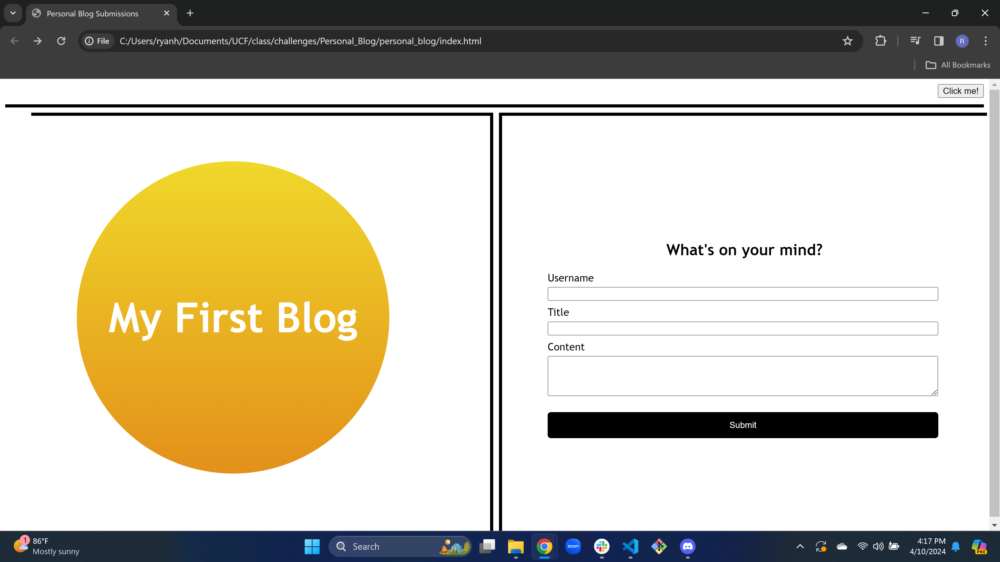
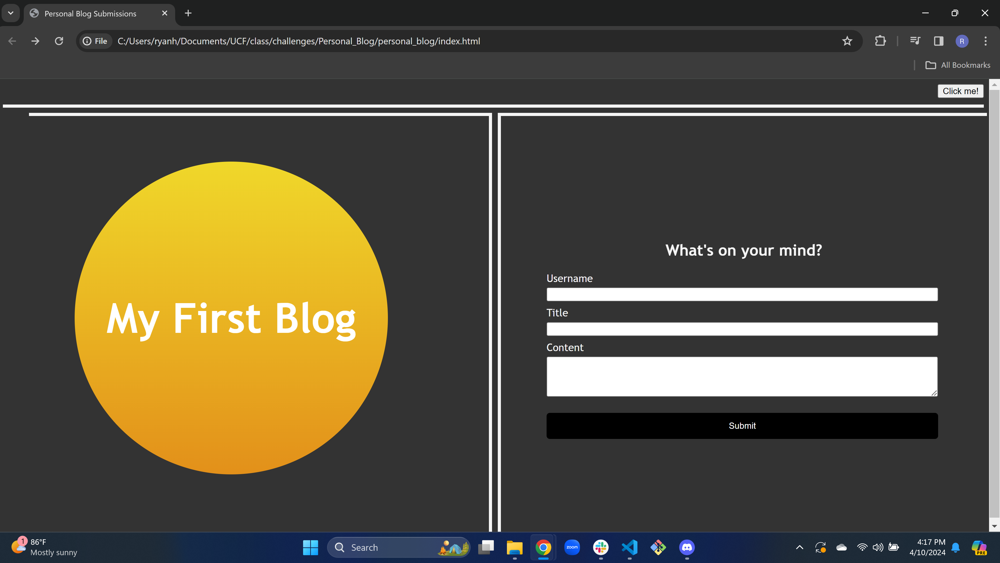
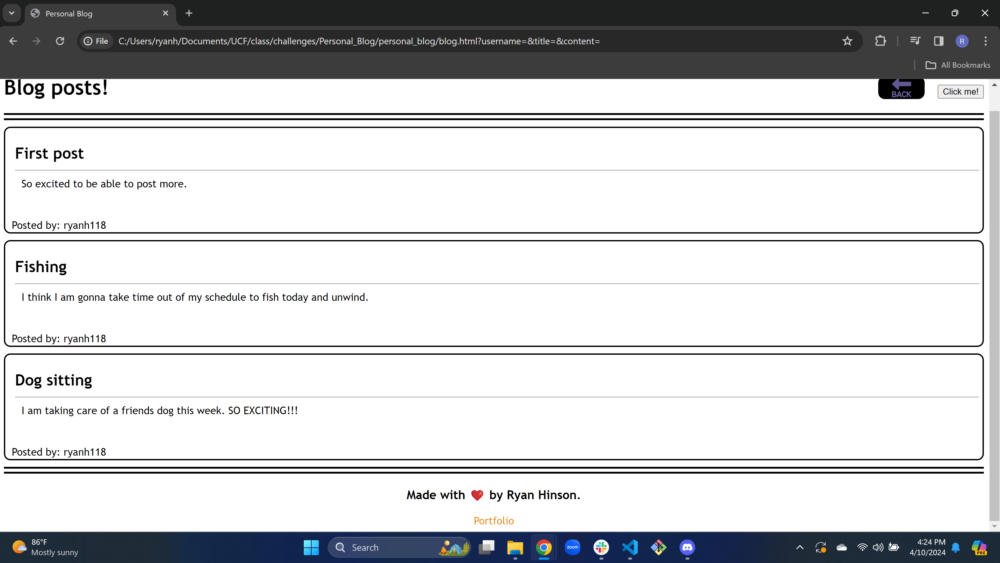
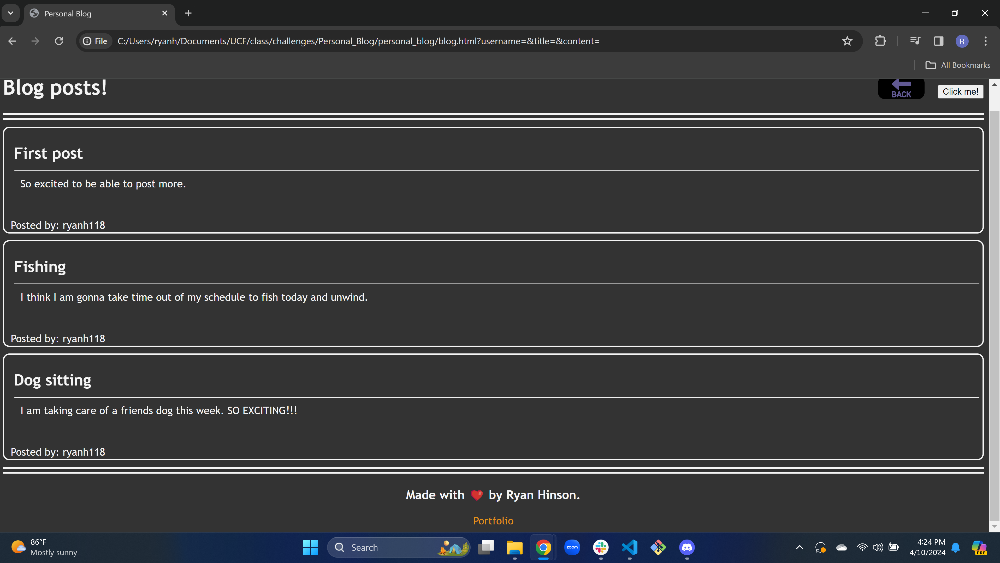

# personal_blog

## Description

I was motivated in this challenge to make my own blog where I can post thoughts and ideas from my head onto a page. The goal I wanted to complete was make a form that would collect the info I put into to localStorage and from there take me to a new page where it would take that info and put it onto the page. I also wanted a back button on the post page so I could go back and make new posts. I also added a theme toggle that can to dark or light depending on preference at the time of use. I learned a lot of javascript throughout my time building this website like intervals for text that can act like an alert but will disapear on its own after a set amount of time. I also learned about push where my new entry would go to the back of my array and stringify and parse where the former takes the object and turns it into the string for the console and the latter takes that string and puts it back into the object so we can display it on the page. The most I learned about was my theme toggle event listener that lets me take my page to a light mode or dark mode with just a click.

## Website Link

https://ryanh118.github.io/personal_blog/

## Usage

